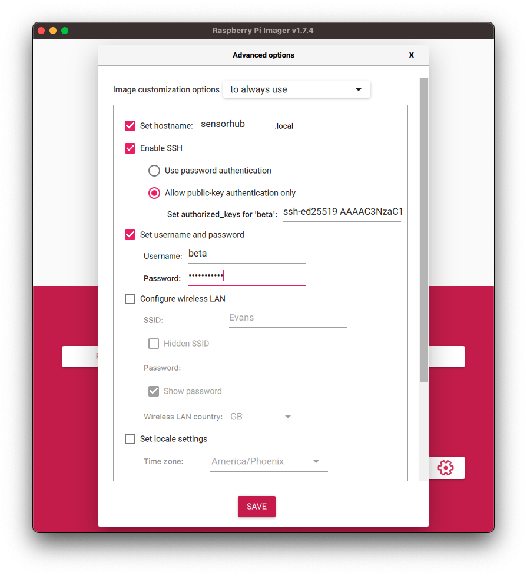

# Setting up Sensor Hub
## Required Items
- Ansible installed on the host computer
- An SSH key
- A local clone of the [4CSCC/sensor-hub
  repository](https://github.com/4cscc/sensor-hub).
- A microSD card
- Raspberry Pi Imager
- Raspberry Pi 3, 4, or 5
- A wired, Ethernet connection

## Steps
### Preparation

- Begin by installing Ansible and the Raspberry Pi Imaging software onto the
  machine you will be using to setup the Pi.

- Create an SSH key if you do not already have one. [GitHub](https://docs.github.com/en/authentication/connecting-to-github-with-ssh/generating-a-new-ssh-key-and-adding-it-to-the-ssh-agent) has a good guide to
  doing this if you have not set one up before.

- Clone the `sensor-hub` repository to your local machine.

### Prepare Image
- Place SD card in reader and open up Raspberry Pi Imager.
- Select `RASPBERRY PI OS(64-BIT)` under `Operating System` and select your
  microSD from under `Storage`.

- Before writing the card, we have some configuration to do first, so click
  the gear at the bottom-right corner of Imager.

- Set hostname to something that will be easy to recognize on your network
- Click the box to select `Enable SSH`, and select the radio button for
  `Alllow public-key authentication only`, then from your machine copy and
  paste the public key for the key-pair that you generated earlier and paste
  it on the line next to where it says `set authorized_keys for:`

- Then set the username and password for the pi you would like to set up, for
  the demo one we will be using 'beta' and 'FourCorners'. If you use something
  else here, just be sure to update the `pis.ini` file before running the
  playbook.

  

- Everything else here should be ok with the defaults, scroll to the bottom
  and click `SAVE`, when the `Advanced Options` dialog closes, you may then
  click the `WRITE` button.

- When the image finishes writing to the MicroSD card and has been verified, remove the card from the reader and place it in the slot on the Raspberry Pi, then plug the Pi into an Ethernet cable connected to a network; finally plug in the power to the Pi.

### Install Sensor-Hub Software

- To install the actual Sensor-Hub software, you will need to have [Ansible](https://docs.ansible.com/ansible/latest/installation_guide/index.html) installed on your host computer.

- Use your terminal to confirm you have SSH access to the Pi, `ssh beta@<Pi-ip-address>`. Your host machine must be connected to the same network the Pi is plugged into. If this fails but you can still ping the pi, you should carefully check the settings used when writing the image, especially those regarding SSH and the key.

- Type exit when you have established a connection, to return to the terminal on your host machine.

- Change into the directory containing the clone from GitHub, and edit the `pis.ini` file, so that `ansible_host=<Pi-ip-address>`. If you have used a different user or password, you should change this file to reflect those changes as well.

- Run the setup by entering: `ansible-playbook -i pis.ini ./playbooks/playbook.yml`

- You may need to manually power cycle the Pi to ensure the `sensor-hub` network starts up appropriately.

### Viewing data

- Currently the, there is a visualization dashboard hosted by Sensor-Hub, that let's you view visualiztion of dashboard data by accessing the server at: `<Pi-ip-address>:8050`